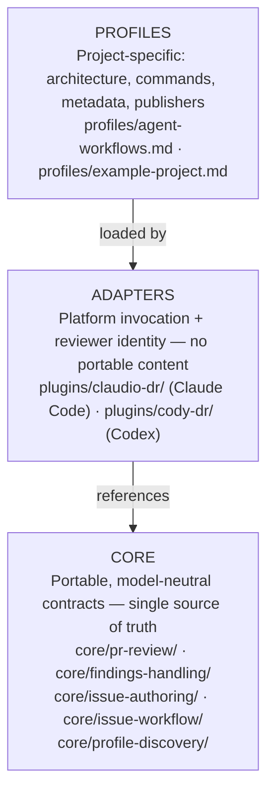
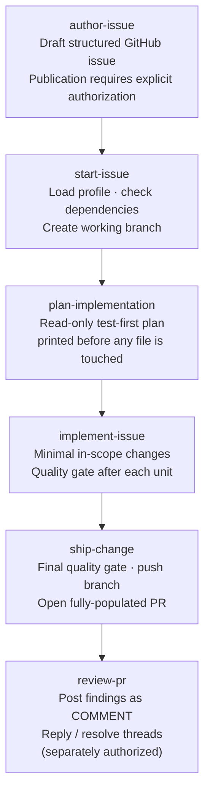

# Agent Workflows

A portable, model-neutral catalog of agent workflows for reviewing pull
requests, handling findings, authoring issues, and driving the full
issue-to-change lifecycle — defined once in `core/`, delivered through thin
adapter plugins for Claude Code and Codex, and tuned per project through
optional profiles.

## Why it exists

AI-assisted code review and issue execution tend to be tied to a single model
or platform. When the model changes, or when a team uses more than one, the
behavior diverges, the prompts drift, and the review quality becomes
inconsistent.

This catalog solves that by separating **what** the agent does (the portable
contract in `core/`) from **how** it does it on a specific platform (the thin
adapter in `plugins/`) and **what rules apply to a specific project** (the
profile). The result is reproducible, auditable agent behavior that travels
with the team, not with the tool.

Design principles:

- **Portable first.** Core contracts are model-neutral — the same logic runs on
  Claude Code and Codex.
- **Profile-driven.** Project rules (commands, labels, branch policy,
  publishers) live in the consuming repository, not in the shared catalog.
- **Explicit publication.** No agent action publishes without an explicit
  request. Branch creation, commits, push, and PR opening are authorized by
  issue execution; reviews, comments, and thread resolution are each separately
  authorized.
- **No secrets in the catalog.** Publisher configuration references secret
  names only; values never appear in any tracked file.

## Architecture overview

The catalog has three independent layers. Each layer has a single
responsibility. No layer reaches into the one above it.



Read [docs/architecture.md](docs/architecture.md) for the full layer diagram
and data flow.

## How it works in practice

A typical issue-to-PR cycle with Claudio DR looks like this:



The same lifecycle runs identically on Codex with Cody DR — same contracts,
same quality gate, same output format, different platform invocation.

## Available skills

| Skill | What it does |
| --- | --- |
| `review-pr` | Evidence-first PR review with incremental re-review |
| `handle-pr-findings` | Triage, fix, defer, or reject findings against the current head |
| `author-issue` | Draft and optionally publish a structured GitHub issue |
| `start-issue` | Load a profile and issue, check dependencies, create working branch |
| `plan-implementation` | Print a read-only, test-first implementation plan before edits |
| `implement-issue` | Make minimal in-scope changes with quality-gate validation |
| `ship-change` | Run final quality gate, prepare PR with profile metadata, push and open |
| `execute-issue` | Orchestrate the full start → plan → implement → ship lifecycle |

## Installation

Use `bin/install` to install the plugins from this catalog onto a machine or
into a specific repository. The script detects conflicts and never silently
overwrites an existing file whose content differs from the source.

```bash
# Install claudio-dr to ~/.claude/ and cody-dr to ~/.codex/ (or $CODEX_CONFIG_DIR)
bin/install --global

# Install claudio-dr into .claude/ inside the current repo
bin/install --repo

# Install with a project-specific profile
bin/install --repo --profile <name>

# Show what is currently installed and where it came from
bin/install --status
```

To update an existing install after pulling new catalog changes, use
`bin/update`. It pulls the catalog with `git pull --ff-only` and then
re-runs the appropriate `bin/install` mode:

```bash
bin/update --global                      # update global install
bin/update --repo [--profile <name>]     # update repo-local install
bin/update --all                         # update both (skips repo if no .claude/)
```

### Claude Code (Claudio DR)

```text
/plugin marketplace add dgaramos/agent-workflows
/plugin install claudio-dr@agent-workflows
```

Invoke a skill or use a workflow agent:

```text
/claudio-dr:execute-issue #42
/claudio-dr:review-pr <PR URL>
/claudio-dr:review-pr <PR URL> using a profile from the target repository
/claudio-dr:author-issue <structured request>
```

See [docs/claudio-dr.md](docs/claudio-dr.md) for the full installation,
update, and local validation flow.

### Codex (Cody DR)

```bash
codex plugin marketplace add /path/to/agent-workflows
codex plugin add cody-dr@agent-workflows
```

Invoke a workflow agent or skill:

```text
@cody-workflow execute issue #42
@cody-reviewer review <PR URL>
@cody-workflow plan issue #42
@cody-helper explain how to use Cody DR in this repository
```

See [docs/cody-dr.md](docs/cody-dr.md) for the full installation and local
validation flow.

### Adding a profile to a target project

Drop a profile into the target repository:

```text
<target-repo>/.agent-review/<name>/PROFILE.md
```

Use `profiles/example-project.md` as the starting template. A profile defines
architecture boundaries, the quality command, PR metadata (labels, milestone,
assignees, Project), and publisher workflow names. It cannot weaken the core
evidence threshold or the explicit-publication boundary.

## Repository structure

```text
core/                    Portable contracts — never touch target-project specifics here
plugins/claudio-dr/      Claude Code adapter — identity and platform mechanics only
plugins/cody-dr/         Codex adapter — identity and platform mechanics only
profiles/                Project profiles — architecture, commands, metadata, publishers
examples/                One generic example per core skill area
docs/                    Compatibility, installation, development docs
bin/check                Catalog quality gate — run before every handoff
bin/install              Install plugins globally or into a repo; detects conflicts
bin/update               Pull the catalog and re-run bin/install for active installs
```

## Status and roadmap

Current milestone: **3** · [Project board](https://github.com/users/dgaramos/projects/11)

What is in place:

- Full PR review and findings-handling contracts (Claudio DR + Cody DR)
- Complete issue-to-change lifecycle (start → plan → implement → ship → execute)
- Issue authoring with optional bot publication
- Profile discovery and loading
- Self-profile for this repository
- Publisher workflows for review, reply, thread resolution, PR metadata, and
  issue creation (both apps)
- Quality gate (`bin/check`) with path, frontmatter, parity, and drift checks
- Installation tooling (`bin/install`, `bin/update`) for global and per-repo deploys

What is next:

- Broader profile library covering additional consumer project archetypes
- Expanded compatibility documentation as platform releases evolve
- Additional generic examples for emerging skill areas

## Contributing

Read [docs/contributing-guide.md](docs/contributing-guide.md) for the full
workflow: picking up an issue, branching, implementing with the correct layer
discipline, committing with the `claudio-dr[bot]` trailer, opening a PR using
the template, dispatching the metadata publisher, and requesting an agent
review.

Before every commit or handoff, run:

```bash
bin/check
```

## Development

Read [docs/architecture.md](docs/architecture.md),
[docs/compatibility.md](docs/compatibility.md), and
[docs/development.md](docs/development.md). GitHub Actions runs the same
`quality` check on every PR and push to `main`.
