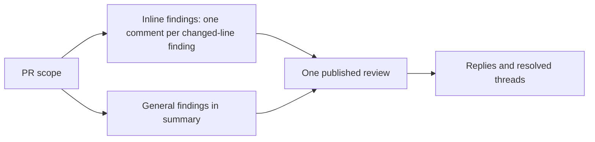

# Portable review contract

Collect the explicit PR/ref, base, current head, changed files, relevant issue,
checks, and existing review discussion. Load the target project's profile before
evaluating the diff. A missing profile means review only generic correctness,
security, compatibility, and evidence; state that limitation in the summary.

Read changed code with its callers, tests, and public contract. Do not treat a
diff in isolation as proof of behavior. For local work, report which staged,
unstaged, and untracked changes were in scope. Do not attribute unrelated files
to the requested review.

## Evidence and findings

Formal findings require current `file:line` evidence, a reproducible flow or
fact, concrete impact, and confidence `>= 80/100`. Put lower-confidence
hypotheses only in the summary as limitations or observations. Do not use style
preference as a finding. A `nit` never justifies requesting changes.

Choose one category and one class:

| Category | Examples |
| --- | --- |
| Security & authorization | validation, sessions, credentials |
| Data integrity & recovery | persistence, migration, backup |
| API & compatibility | public interface or protocol |
| Behavior & reliability | flow, failure, idempotency |
| Architecture & maintainability | concrete boundary risk |
| Tests & observability | missing behavioral evidence |
| Documentation & contribution | incorrect public instruction |
| Performance & capacity | measurable scale or resource risk |

| Class | Badge | Meaning |
| --- | --- | --- |
| blocking | 🔴 Critical | material security, data, contract, or failure risk; requests change |
| important | 🟠 Major | probable regression or incompatibility; requests change |
| nit | 🟡 Minor | concrete non-blocking improvement; never requests change |

```md
<category> · <badge> · <⚡ Quick win|🔧 Focused change|🧩 Follow-up>

**<short imperative title>**

<objective explanation of the failing flow or condition.>

**Evidence:** `<file:line>` — <verified fact>; confidence: <N>/100.
**Impact:** <concrete consequence>.
**Suggested fix:** <smallest credible correction>.
```

Inline findings require a changed line. General findings use `[general]` as the
location and go in the review body.

## Re-review

When reviewing a PR again after changes, load all current threads, top-level
comments, reviews, and their states. Locate the last head reviewed by the same
reviewer.

1. If the prior SHA is trustworthy and ancestral to the current head, inspect
   only the diff from prior head to current head for new findings.
2. Otherwise, declare the delta unverifiable and review the full current
   base-to-head comparison.
3. Classify every previous finding as `resolved`, `fixed but thread open`,
   `unresolved`, `superseded`, or `unverifiable`. Thread replies are context,
   not proof. Do not repeat resolved findings.

Use the re-review preamble in the summary section below before the
new-findings section.

## Publication boundary

Prepare a review body and inline comments only after verifying the current head.
Publish, reply, resolve threads, approve, or request changes only when the user
explicitly asks and the target profile provides an external publisher. Never look
for credentials in the target repository.

Without a publisher, return the same formatted content as `not published`.

For authorized publication, use `REQUEST_CHANGES` for blocking or important
findings, `COMMENT` for nit-only findings, and `APPROVE` only with no findings.

Submit **one single PR review** through a publication manifest that bundles all
findings and thread actions together:

- Findings whose evidence line is in the diff → inline comments in the review's
  `comments` array, each at the exact `path` and `line` (or `position`) from
  the evidence. Do not open a separate review per finding.
- Findings whose evidence line is outside the diff or marked `[general]` →
  included in the review body, not as standalone pull request comments.
- The review body also contains the summary block.

Never submit multiple review events for the same pass. Never post findings as
standalone pull request comments outside a review submission.

The manifest contains `review_body`, `inline_comments`, `replies`, and
`resolve_thread_ids`. `inline_comments` is an array of `{path, line, body}`:
every formal finding on a changed line gets its own entry. A publisher that
cannot submit that array must return the manifest as `not published`; it must
never collapse those findings into one general comment. `replies` and
`resolve_thread_ids` are validated against the supplied PR before publication.

After publishing, verify the resulting review's author and event match the
expected reviewer identity. After replying to a thread, verify the reply is
authored by the expected reviewer in the intended thread. After resolving a
thread, verify the App resolved the intended thread.

## Summary

Emit one summary block per review:

```md
## Review — <reviewer name>

**Scope:** <PR/ref>, `<base>` → `<head>`
**Reviewed head:** `<sha>`
**Profile:** <profile name or none>
**Checks:** <consulted results>; not run: <reason or none>
**Findings:** 🔴 Critical: N · 🟠 Major: N · 🟡 Minor: N
**Risk axes:** <evaluated>; not applicable: <axes>
**Verdict:** `<approve|request changes|comment|no findings>`
**Publication:** `<not requested|not published|published by <reviewer name>>`


```

With no findings, keep the zero counts and state actual review limitations.

## Re-review preamble

```md
## Re-review — <PR/ref>

**Previous reviewed head:** `<sha or unavailable>`
**Current head:** `<sha>`
**Delta:** <prior head → current head, or full comparison and reason>
**Previous findings:** resolved: N · fixed but thread open: N · unresolved: N · superseded: N · unverifiable: N
**Discussion checked:** <threads and general comments consulted>
```
