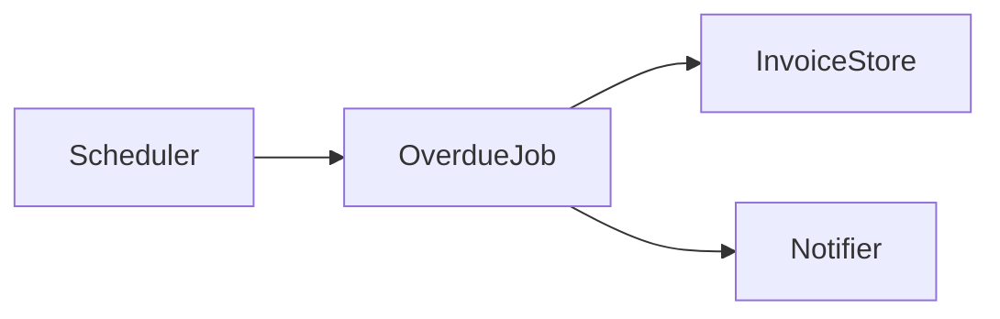

# Generic Spec-Driven Development example

A request asks for a service to notify a customer when an invoice becomes
overdue. A spec agent can produce this minimal trio without assuming a specific
application stack.

## `requirements.md`

````md
## Objetivo

Notify the customer once when an invoice becomes overdue.

## Requisitos funcionais

- Identify invoices whose due date has passed and that have not been paid.
- Send one notification per overdue invoice.

## Requisitos não-funcionais

- The notification attempt must be observable in service logs.

## Critérios de aceite

- Given an unpaid invoice past its due date, when the overdue job runs, then
  one notification is requested; if delivery fails, the failure is recorded
  and the invoice is not marked as notified.

## Condições de falha

- A notification-provider error is logged with the invoice identifier and can
  be retried by the next scheduled run.

## Boundaries

| Status | Scope |
| --- | --- |
| ✅ | Detect and notify overdue invoices |
| ⚠️ | Retry cadence depends on the host project |
| 🚫 | Collecting payment |
````

## `design.md`

````md
## Stack

The host project's scheduler, invoice store, and notification provider.

## Arquitetura



The job queries unpaid overdue invoices and asks the notifier to deliver one
message for each invoice.

## Contratos de componente

- `InvoiceStore.findOverdueUnpaid()` returns unpaid invoices past their due date.
- `Notifier.sendOverdue(invoice)` reports success or a recoverable error.

## Estratégia de teste

- Verify the job requests one notification for an overdue unpaid invoice.
- Verify a notifier error is recorded and does not mark the invoice notified.
````

## `tasks.md`

```md
- [ ] Add overdue-invoice selection to the scheduled job.
  - Verification: `npm test -- overdue-job-selection`
- [ ] Request notification delivery and record failures.
  - Verification: `npm test -- overdue-job-notification`

## Checkpoint

Confirm the host project's retry policy before adding retries.
```

The example is illustrative: its commands and components are not portable
requirements for consuming projects.
