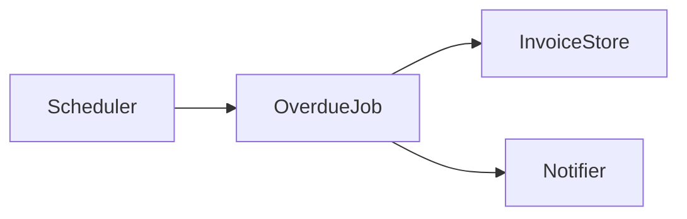

# Generic Spec-Driven Development example

A request asks for a service to notify a customer when an invoice becomes
overdue. A spec agent can produce this minimal trio without assuming a specific
application stack.

## Design Brief

- **Outcome:** notify a customer once when an unpaid invoice becomes overdue.
- **Constraint:** the host project owns retry policy and provider selection.
- **Open question:** whether retries are enabled; this becomes a checkpoint,
  not an inferred implementation detail.

## Authorized source

The consuming profile declares exactly one accessible source before an agent
resolves the trio:

```md
## Spec source

- **Repository:** `${ACME_SPECS_REPOSITORY}`
- **Authorized path:** `specs/billing/overdue-invoice-notifications/`
```

The invoking environment sets `ACME_SPECS_REPOSITORY=acme/specs`. Without both
fields and a resolved value, an agent can draft the trio in conversation but
does not read or write an external repository.

## `requirements.md`

````md
## Objetivo

Notify the customer once when an invoice becomes overdue.

## Requisitos funcionais

- Identify invoices whose due date has passed and that have not been paid.
- Send one notification per overdue invoice.

## Requisitos não-funcionais

- The notification attempt must be observable in service logs.

## Critérios de aceite

- [AC-01] Given an unpaid invoice past its due date, when the overdue job runs, then
  one notification is requested; if delivery fails, the failure is recorded
  and the invoice is not marked as notified.

## Condições de falha

- A notification-provider error is logged with the invoice identifier and can
  be retried by the next scheduled run.

## Boundaries

| Status | Scope |
| --- | --- |
| ✅ | Detect and notify overdue invoices |
| ⚠️ | Retry cadence depends on the host project |
| 🚫 | Collecting payment |
````

## `design.md`

````md
## Stack

The host project's scheduler, invoice store, and notification provider.

## Arquitetura



The job queries unpaid overdue invoices and asks the notifier to deliver one
message for each invoice.

## Contratos de componente

- `InvoiceStore.findOverdueUnpaid()` returns unpaid invoices past their due date.
- `Notifier.sendOverdue(invoice)` reports success or a recoverable error.

## Estratégia de teste

- Verify the job requests one notification for an overdue unpaid invoice.
- Verify a notifier error is recorded and does not mark the invoice notified.
````

## `tasks.md`

```md
- [ ] T01 [AC-01] Add overdue-invoice selection to the scheduled job.
  - Verification: `npm test -- overdue-job-selection`
- [ ] T02 [AC-01] Request notification delivery and record failures.
  - Verification: `npm test -- overdue-job-notification`

## Checkpoint

Confirm the host project's retry policy before adding retries.
```

## Issue reference and execution

After the trio is accepted, the implementation issue records its exact source:

```md
Spec: acme/specs/specs/billing/overdue-invoice-notifications/
```

The executor verifies that the issue reference exactly matches the loaded
profile declaration, then reads `tasks.md` as read-only input. It performs the
tasks in order and runs each `Verification:` command after its task. Its
summary records `T01 → AC-01 → passed` and `T02 → AC-01 → passed`; a legacy
trio without these links is reported as traceability unavailable rather than
being inferred. At the checkpoint, it stops unless the caller explicitly
authorized continuous execution. The checkpoint does not authorize publication,
merge, or an unrelated external write.

The example is illustrative: its commands and components are not portable
requirements for consuming projects.
